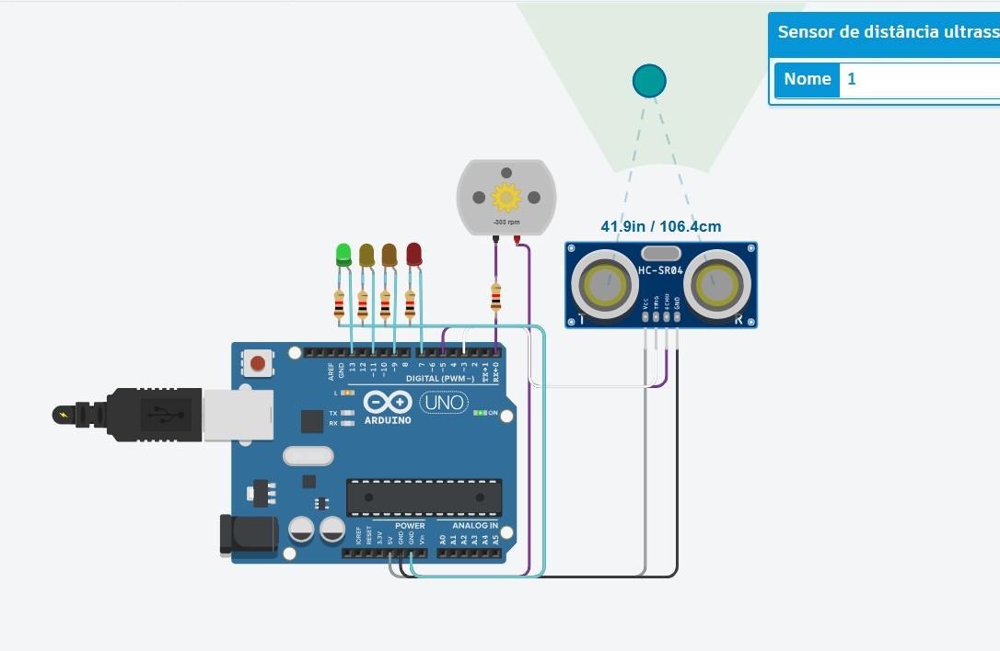

# 💧 Sensor de Nível para Caixa d'Água com Arduino

## 📌 Descrição do Projeto

Este projeto implementa um **sistema de monitoramento de nível de água para caixas d'água** utilizando Arduino. O sistema utiliza um **sensor ultrassônico HC-SR04** para medir a distância entre o sensor e o nível da água dentro da caixa.

Com base nessa distância, o sistema identifica o **nível aproximado da água** e sinaliza visualmente através de **LEDs indicadores**. Além disso, um **motor pode ser acionado** para simular o funcionamento de uma bomba d'água responsável por encher o reservatório.

Esse tipo de solução é comum em **sistemas de automação residencial e controle de reservatórios**.

---

## ⚙️ Componentes Utilizados

* 1 × Arduino Uno R3
* 1 × Sensor ultrassônico HC-SR04
* 1 × Motor DC (simulação de bomba d'água)
* 4 × LEDs indicadores
* 4 × Resistores (220Ω ou 330Ω)
* 1 × Protoboard
* Jumpers (fios de conexão)

---

## 🔌 Principais Conexões

### Sensor Ultrassônico HC-SR04

O sensor ultrassônico é responsável por medir a **distância até a superfície da água**.

Conexões:

* VCC → 5V do Arduino
* GND → GND
* TRIG → pino digital do Arduino
* ECHO → pino digital do Arduino

---

### LEDs Indicadores

Os LEDs representam o **nível de água dentro da caixa**:

| LED          | Indicação         |
| ------------ | ----------------- |
| LED Verde    | Caixa cheia       |
| LED Amarelo  | Nível médio       |
| LED Laranja  | Nível baixo       |
| LED Vermelho | Caixa quase vazia |

Cada LED é conectado a um **pino digital do Arduino com resistor limitador de corrente**.

---

### Motor DC

O motor representa uma **bomba d'água** que pode ser ativada quando o nível da água estiver baixo, simulando o enchimento automático do reservatório.

Conexões:

* Terminal positivo → pino digital do Arduino
* Terminal negativo → GND

---

## 🔄 Funcionamento do Sistema

1. O sensor ultrassônico mede continuamente a **distância até a superfície da água**.
2. O Arduino calcula o **nível aproximado do reservatório**.
3. Dependendo da distância detectada:

   * LEDs indicam o nível atual da água.
4. Caso o nível esteja muito baixo:

   * o sistema pode **ativar o motor**, simulando o acionamento de uma bomba para reabastecer a caixa.

---

## 🎯 Objetivo Educacional

Este projeto foi desenvolvido para demonstrar conceitos de **sistemas embarcados aplicados à automação**, incluindo:

* uso de **sensor ultrassônico**
* medição de distância
* controle de **atuadores (motor)**
* sinalização com **LEDs**
* lógica de automação em microcontroladores

---

## 🚀 Possíveis Melhorias

Algumas melhorias que podem ser implementadas no projeto:

* adicionar **display LCD para mostrar o nível da água**
* enviar dados para um **aplicativo ou servidor IoT**
* integrar **módulo WiFi (ESP8266 ou ESP32)**
* adicionar **alerta sonoro quando o nível estiver crítico**
* controlar uma **bomba real através de relé**
